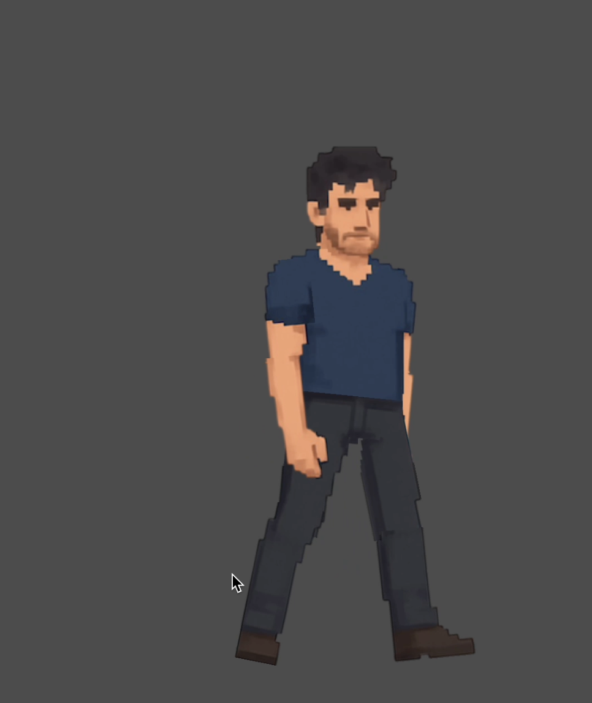
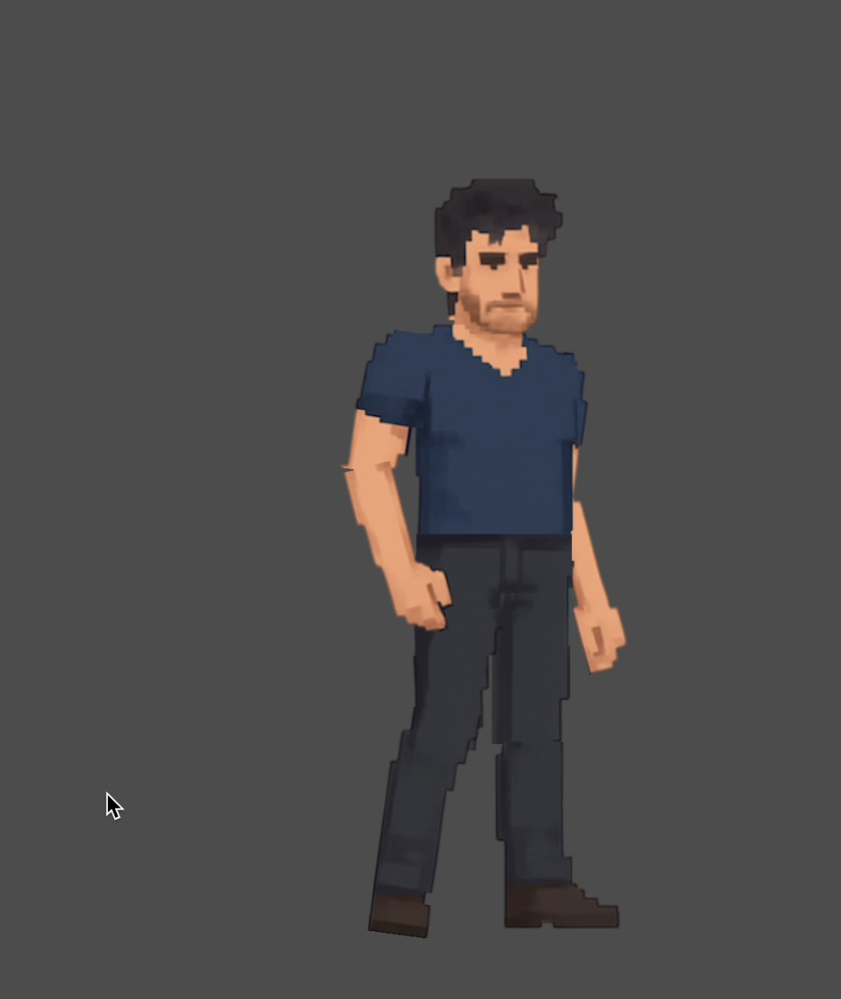

# Godot 2D Character Joint System

This repository contains a C# script for creating and animating **2D articulated characters** in Godot.  
It provides a joint-based structure that allows moving and rotating individual parts of a character.

---

## Joint Structure

A **Joint** represents a pivot point with an attached sprite and optional child joints. Each joint contains:

- **Sprite**: The visual representation (Sprite2D) of this part.
- **FixedPoint**: The world position of the pivot.
- **beFixedPoint**: An array of polar coordinates (radius, angle) for child joints relative to this joint.
- **angle**: The swing range (min/max) for rotation.
- **Next**: An array of child joints connected to this joint.

The default character structure assumes **10 main parts**

> **Important:** Many methods are **hard-coded** for this 10-part human-like structure.  
> If your object has different parts or more than 10 elements, you need to **rewrite `BuildBody`**.

---

## Parameter Sets

The `parameters` array defines **how each character is built and proportioned**.  
Each parameter set corresponds to a different character or style and contains **polar coordinates** (radius, angle) for the main body parts relative to the torso.

- Each element in `parameters[index]` corresponds to a joint in the default humanoid hierarchy:
  1. Head
  2. Right Arm
  3. Left Arm
  4. Right Thigh
  5. Left Thigh
  6. Right Forearm
  7. Left Forearm
  8. Right Shin
  9. Left Shin
  10. Underwear / optional visual part

- **Vector2 format:** `(radius, angle)`  
  - `radius` controls the distance from the parent joint (usually the torso).  
  - `angle` controls the orientation relative to the parent joint.

> **Important:** The `parameter set` directly determines the size, limb length, and orientation of your character.  
> If you change the number of parts or the layout, you must adjust both `parameters` and `BuildBody()` accordingly.


---

# Demo Images

## Walking Animation Example
<p float="left">
  
  
  
  
</p>

---

## Running Animation Example
<p float="left">
  
  
  
  
</p>

---

## Jumping Animation Example
<p float="left">
  
  
  
</p>

---

## Key Methods

### Initialization

- **`InitializeCharacter(int index, Vector2 position)`**  
  Creates the joint hierarchy and attaches sprites based on pre-defined parameters.

- **`BuildBody(...)`**  
  Constructs the joint tree and positions each part. Hard-coded for the default 10-part humanoid.

### Motion

- **`Moving_Joint(Joint j, Vector2 speed)`**  
  Moves the joint and all child joints by a world-space offset.

- **`Rotating_Joint(Joint j, float rotation_rate)`**  
  Rotates the joint around its pivot and updates child joint positions accordingly.

- **`ScaleCharacter(float factor)`**  
  Scales the entire character, including all joints and sprites.

- **Animation Helpers**  
  Pre-defined pose dictionaries for walking, running, and jumping:  
  - `FirstStepPose`, `SecondStepPose`, … , etc.  
  These poses are applied with `ApplyPose()` to animate the character over time.

- **`Turn_Around(Joint root, bool truth)`**  
  Flips the character horizontally around its central axis.

### Input Conversion

- **`ToGodotInput(object input)`**  
  Converts input vectors or angles to Godot coordinate conventions (positive Y downward). Scales according to `CharacterScale`.

---

## Usage Notes

1. **Hard-coded Limitation**  
   - The system is designed for a human-like character with the 10 main parts listed above.  
   - If your object differs in structure or has additional parts, **`BuildBody` must be rewritten**.

2. **Custom Animations**  
   - Only walking, running, and jumping are pre-defined.  
   - For other animations, you must call `Moving_Joint` and `Rotating_Joint` yourself, optionally creating new pose dictionaries.

3. **Recursive Joint Handling**  
   - `Moving_Joint` and `Rotating_Joint` automatically propagate changes to all child joints.  
   - Be cautious of `null` child joints when extending your own characters.

4. **Scaling**  
   - `ScaleCharacter` multiplies positions, polar offsets, and sprite scales for the whole hierarchy.  
   - Ensure scaling is uniform to maintain relative joint alignment.

5. **Asynchronous Animations**  
   - All animation methods are `async` and can be awaited.  
   - The system ensures only one motion runs at a time via `_currentMotion`.

---

## Example: Basic Usage

```csharp
Protagonist character = new Protagonist();

// Initialize the character at position (200, 300) using parameter set
character.InitializeCharacter(1, new Vector2(200, 300));

// Scale the character
character.ScaleCharacter(1.5f);

// Animate walking
await character.Walking(character.joints_group, true);

// Turn around
await character.Turn_Around(character.joints_group, true);
